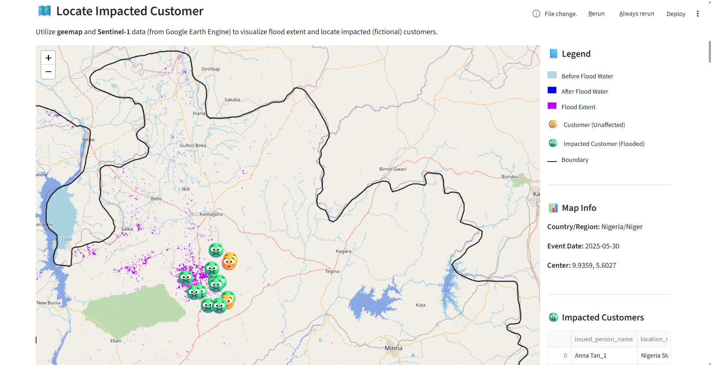

# 🚀 Smart Insurance Claims After Disasters

A smart tool powered by GenAI and Satellite Imagery, designed to accelerate insurance claims by identifying impacted policyholders following a disaster.

---
## 🧭 Background
Working as an AI solution engineer for fintech clients and being passionate about using satellite imagery for social good, I’ve always wanted to bring both worlds together. Inspired by remote sensing providers’ insurtech use cases, I built this mini project to put that idea into practice.

## 🌟 Features

- **Real-time Flood Event Detection**  
  Automatically scrapes flood alerts and events from [ReliefWeb](https://reliefweb.int/).

- **Intelligent Location Matching**  
  Uses LLMs (via Ollama) to match reported flood locations to GAUL administrative boundaries.

- **Satellite Imagery Analysis**  
  Leverages Google Earth Engine and Sentinel-1 radar data to map flood extent accurately.

- **Customer Impact Assessment**  
  Cross-references flood zones with insurance policyholder locations to assess potential impact.

- **Interactive Visualization**  
  Streamlit-powered dashboard that displays intuitive maps of flood extent and affected customers.

---

## 📊 Example Use Case

  
*Above: Streamlit app showing flood-affected area (purple) overlaid with impacted customer locations (green face)*

👉 [View full-screen PDF](demo.pdf)

---

## 📦 Tech Stack

- **Streamlit** – for building the web app
- **Ollama** – for running LLMs locally (e.g., for text-based location resolution)
- **Google Earth Engine** – for processing Sentinel-1 imagery
- **geemap** – for integrating GEE with Python
- **Sentinel-1** – radar satellite data used for flood detection
- **Python** – for backend logic and automation

#### 👉 [View full code](app.py)
---

## 📚 Data Sources

- [ReliefWeb](https://reliefweb.int/) – Real-time global disaster events and alerts  
- [GAUL (Global Administrative Unit Layers)](https://data.apps.fao.org/map/catalog/srv/eng/catalog.search#/metadata/90e70100-5501-11da-a88f-000d939bc5d8) – Official boundaries for administrative regions

---

## 🚧 Status

This is a **prototype** and part of a mini project demonstrating how GenAI and earth observation data can enhance the insurance industry’s response to natural disasters.

---

## 📌 Future Work

- Support for other disaster types (e.g. wildfire, earthquake)
- Integration with real insurer databases
- Add function of adjuster dispatch

---

